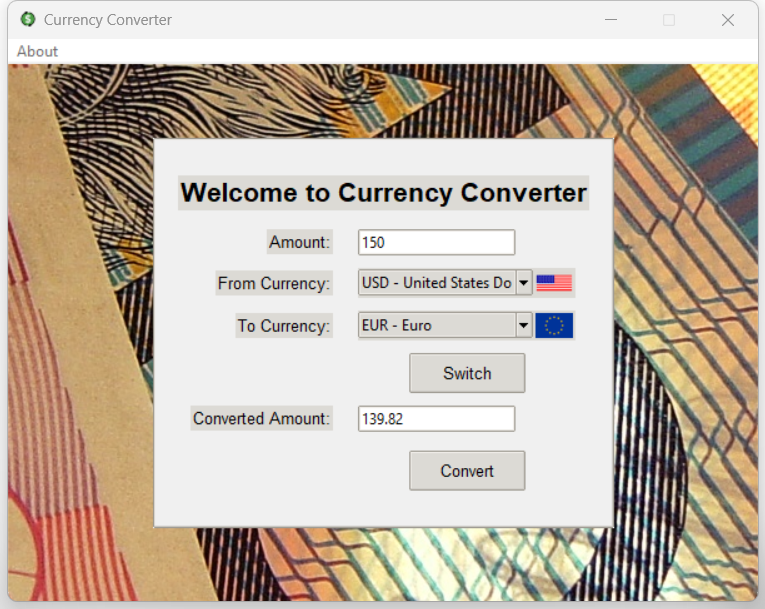

# 💱 Currency Converter

Currency Converter is a user-friendly desktop application that allows users to convert between different currencies. The application fetches live exchange rates using the Exchange Rates Data API and displays relevant currency flags to enhance the user experience.

## 🌟 Features

- 🔄 Convert amounts between multiple currencies.
- 🌐 Fetch live exchange rates using the Exchange Rates Data API.
- 🏳️ Display currency flags for a more intuitive interface.
- 🖥️ Cross-platform support (Windows and Linux).

## 🖼️ Screenshots



## 🗂️ Project Structure

```
CurrencyConverter/
│
├── gallery                     # Directory with pictures used
├── dist                        # Directory where exe file is stored
├── main.py                     # Entry point for the application
├── currency_converter.py       # Contains the CurrencyConverter class and logic
├── ui.py                       # UI-related logic and setup
├── README.md                   # This README file
└── requirements.txt            # Dependencies required for the application
```

## 🚀 Getting Started

To run the application, follow these steps:

1. Ensure you have Python installed on your system. You can download it from [python.org](https://www.python.org/).
2. Install the required Python packages by running:
   ```sh
   pip install -r requirements.txt
   ```
3. Run the application by executing:
   ```sh
   python main.py
   ```

## 📦 Executables

Pre-built executables for Windows and Linux are available in the `dist` folder. You can run the executable directly without needing to set up a Python environment.

## 🛠️ Requirements

- Python 3.x
- `requests`
- `pillow`
- `pyinstaller`

The `requirements.txt` file lists these dependencies:

```plaintext
requests
pillow
pyinstaller
```

## 🌐 APIs Used

### Exchange Rates Data API

This application uses the Exchange Rates Data API to fetch live currency exchange rates. You can find more information about the API [here](https://apilayer.com/marketplace/exchangerates_data-api).

### Flags API

The application uses the Flags API from [flagsapi.com](https://flagsapi.com) to fetch country flags for the currencies.

### Setting API Key

The application comes with a default free API key. However, there may be times when you will be prompted to enter your own API key from the Exchange Rates Data API. You can obtain a free API key [here](https://apilayer.com/marketplace/exchangerates_data-api).

## 🙏 Credits

- **Author**: Stanisław Dutkiewicz
- **Icon**: The icon used in this application is credited to **vecteezy.com** [link](https://www.vecteezy.com/vector-art/28671104-dollar-turnover-icon-money-exchange-symbol-business-concept-vector-in-isolation-on-white-background)
- **Background Image**: The background image used in this application is credited to **freeimages.com** [link](https://www.freeimages.com/photo/aust-currency-1-1536312)

## 📄 License

This project is licensed under the MIT License - see the [LICENSE](LICENSE) file for details.
